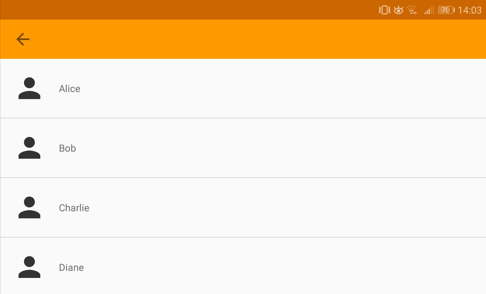

# android-speaker-identification

  

Prototypical Android app for indentifying users, based on their voice

## About
As part of a bachelor thesis, covering various means of differentiating users in order to enable a personalized experience, the prototype at hand aims to realize a user-identification-system, based on the human voice.

The thesis extensively focused on the usage of smart robot assistants, both in the context of home and medical care. Thus identifying users serves the purpose of granting those with certain disabilities an personal treatment with respect to their individual needs.

## Getting started

### Prerequisites

1. Clone or download the project.

```bash
git clone https://github.com/vvvt/android-speaker-identification.git
```

2. Build the app with Android Studio or a similar application.

### Installing

Either run the App from within Android Studio, using a virtual or connected device, or alternatively generate an APK, copy it to your device and install it.

## Usage

### Sections

#### Main Activity


The MainActivity serves as the general entry point and navigation hub. Nothing fancy here.

#### Registration Activity


The RegistrationActivity implements the registration of new users.

Pushing the &#127897; button starts a new recording, while pressing it again stops it. Repeating the process overwrites the current recording. Pressing the :arrow_forward: button after a voice sample has been recorded, plays back the audio file.

Pressing the **Add Speaker** button starts the feature analysis and finally creates a new entry in the database.

#### Identification Activity


After new speakers have been added in the RegistrationActivity, they can be identified in the IdentificationActivity. In a similar fashion, new voice samples can be recorded and played back.

After the recording has stopped, the app returns three values:

**SpeakerID** - *Name of the identified user*

**Score** - *Confidence value, indicating the likelyness of a correct identification*

**Match** - *Returns a true or false, based on whether the attained score exceeds a defined threshold*

#### Directory Activity



The DirectoryActivity lists all registered speakers. Users can be removed from the database by selecting the respective entry.

### Hints

* A "good" confidence value isn't officially defined by the creators of the framework. Searching various forums led to an assumed value of 70 for indicating a reliable identification result

* In evaluation the prototype showed the best results with an initial sample length of >60 seconds. Tests with a lenght of 7 seconds were faulty and yielded mixed results with a 30 second training set.

## Built with

* [Android](https://www.android.com/) - The World's Most Popular Mobile Platform
* [Alizé](https://github.com/ALIZE-Speaker-Recognition/android-alize) - The framework utilized for recognizing speakers

## Authors

* **Vincent Thiele** - *Prototype Development* - [vvvt](https://github.com/vvvt)

## License

This project is licensed under the MIT License - see the [LICENSE.md](LICENSE.md) file for details

## Acknowledgments

* **David Gollasch** - *project supervision and guidance* - [DavidGollasch](https://github.com/DavidGollasch)

* **Mitch Tabian** - *example implementation of the SQLite Database* - [mitchtabian](https://github.com/mitchtabian)
